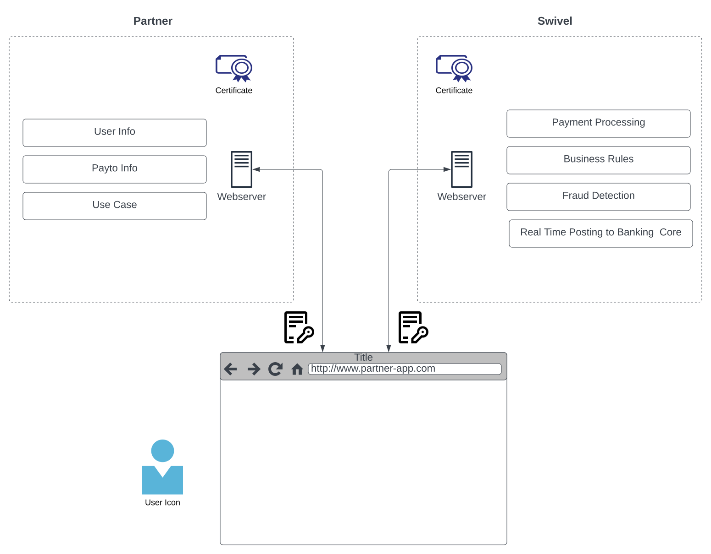

# Swivel SDK

## A set of experiences allowing easy integration with partners.

Swivel SDK offers:

  * **Intgrated UI**:
  Develop with your use case in mind, and the Swivel SDK takes care of the managing the experience with the user.
  
  * **Industry Compliant Solution**:
  The Swivel SDK helps integrate your application with our Payments, Tokenization and Verification services that are PCI and NACHA compliant.
  
  * **Web Browser based**:
  Supporting modern browsers that puts your user at the center of the [experience]. (./docs/getting_started.md)

## Overview

## Docs

* ### [Getting Started](./docs/getting_started.md)
* ### [Experiences Offered](./docs/experiences_offered.md)

